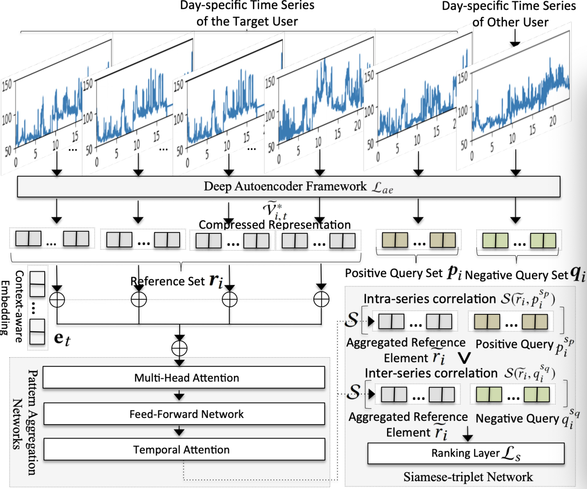

# heartspace
This code is for "Your Heart Rate Reveals Who You Are: Representation Learning on Wearable-Sensory Time Series Data".
## Framework

## Environments 
  Python: 2.7
  
  Tensor-Flow: 1.6
  
  Numpy: 1.14.3

  cuda: 8.0
  
  cudnn:v6.0

## Example to run this code
To run the heartspace code, we provide two options.

(1) test.py allows run the heartspace model on the real data.

`python3 test.py`

(2) model_date_portal.py runs the algorithm using synthetic data with the purpose of providing users with the example input and output formats of heartspace.

`python3 model_date_portal.py`
